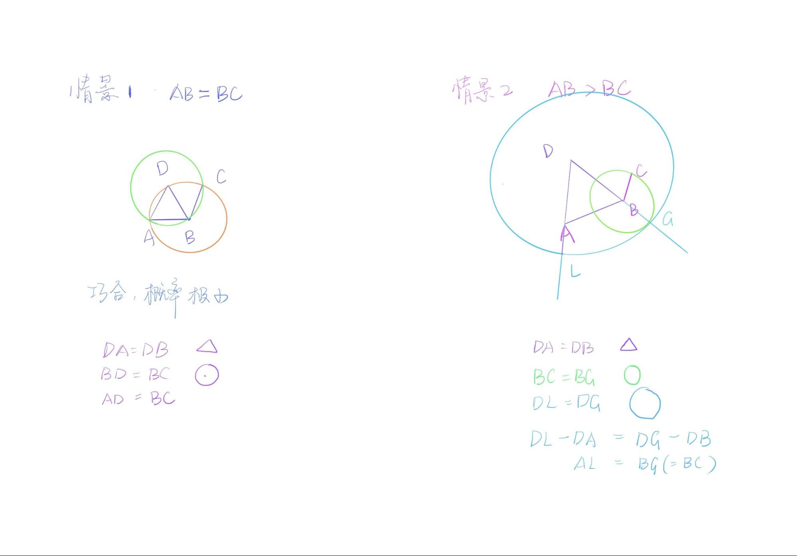

# 第二课（命题二）
**由给定一点（为端点）作一线段，使与一给定线段相等。**

今天我们来一起讨论命题二。

Alex首先尝试自己解题。尝试的第一种方法是画好点A和线段BC后，以圆规为媒介，将与BC相同的距离转移到点A上，确定两端点后，所连成的线段就是与BC相等且A为一端点的。似乎除了圆规外，直尺也可以帮助实现这个转移。然而需要注意的是，古希腊的直尺是没有任何标记的，只是为了辅助取“直”，而非用尺度量。那么我们将直尺这个选项在此排除掉。

接下来我们需要理解的事情是，为什么这里欧几里得没有用圆规来“乾坤大挪移”线段，而是选择命题的方式来完成这个任务。我和俊豪对此进行讨论。

将圆规作为量的载体，进行挪移的时候，是没有一个相对的体系能够保证量的不变。除非在公设中加入一条专门对此工具应用的假设。另外可以观察到，圆规与直尺的作用都是绘制，不涉及到量大小的问题。圆规的本意是用来画圆，只是我们可以发挥聪明才智也做些别的事情，但是除了画圆以外的功能都是没有得到承认的。也因此这里在能够证明的情况下，选择证明的方式。

如果聊的远些，来思考一下几何与现实世界的关系是什么？在实际生活中我们所观察到的几何图形，都是绝对意义上的几何吗？举个例子，一本书的封皮有磨损折痕的话那还是长方形么？我们常常说几何图形是抽象的，我们甚至可以说是概念化的，也就是在生活中很难找到绝对意义上的存在，而与它相连接的具体事物(具象)则随处可见。工具更多的是与具象相连的存在，在抽象的概念中，我们能够达成一致认可某一个无参照系，无判断和验证手段的转移行为是在所有人的脑海中通用的？很难。

和Alex一起理解了圆规的尝试或许在现在生活中可以操作，但是却不能在严谨的抽象构建中使用。接下来我们看命题二的证明。

命题二的证明并不难，但是这道题有两个地方值得拿出来细看。

第一个问题很有趣，那就是图像和文字所蕴含信息的不对等性。这是什么意思呢？在命题二中，给定线段BC和所连线段AB的长短比较会直接影响到图像的呈现。也就是AB大于BC, AB等于BC和AB小于BC三种情况是对应了三种图像然而图像的改变不影响文字的书写。

除却原书编者的配图以外，还有以下两种可能的配图。

```{r echo=FALSE, out.width='100%'}

```

如果我们将三种情况用等式来标明，会发现量的大小也并没有影响逻辑推理。如此说来，图像传递了我们怎样的信息呢？

**相等(AB=BC)** <br>
因为BC=BD，DB=DA，所以DA=BC <br>
注意这里并不能直接写AB=BC<br>

**AB > BC**<br>
因为DL=DG, DA = DB, 所以AL(DL-DA) = BG(DG-DB)<br>
又因为BG = BC<br>
所以AL = BC<br>

**AB < BC**<br>
因为DL=DG, DA = DB, 所以AL(DL-DA) = BG(DG-DB)<br>
又因为BG = BC<br>
所以AL = BC<br>

在此想要学习的第二个部分，是以命题二为例，说明如何记忆理解一个几何证明。看命题二的完整论证，是非常长的文字，在刚刚我们也转换成了公式，似乎事情变得更加明了，但是字母并不好记，如何才能将这个证明题完全掌握呢？ 尽管我们刚刚总结了图像不能概括命题，然而图像在此却是记忆的一大助力。

```{r echo=FALSE, out.width='100%'}
knitr::include_graphics('./image/02-prop2-image2.jpg')
```

我们可以将完整的图形进行简化处理，只记最核心的部分，即两条边加旁边的小尾巴即可。之后想着两条边是某圆的半径，小尾巴和某边的一部分也是另一个圆的半径，此边的剩余部分和另外一条边的某部分是等边关系，所以另外一条边剩余的边和小尾巴相等。如此，通过色彩线段就可以回忆起整个命题的推理了。任意一道几何题，必定有其最核心的点和线，以及关键辅助线，而学习几何最重要的一部分也是学会抓重点和脉络，一旦能够通过图像把握证明的结构，那么整道题都会迎刃而解。

基于命题二就先讨论到这里了。

参考作业：

图像 与 文字

找一个绘本，随意找一页，尝试去定义文字和图像中重合的关键信息。只看文字，自己想象图画，然后只看图画，尝试自己用文字描述。 
