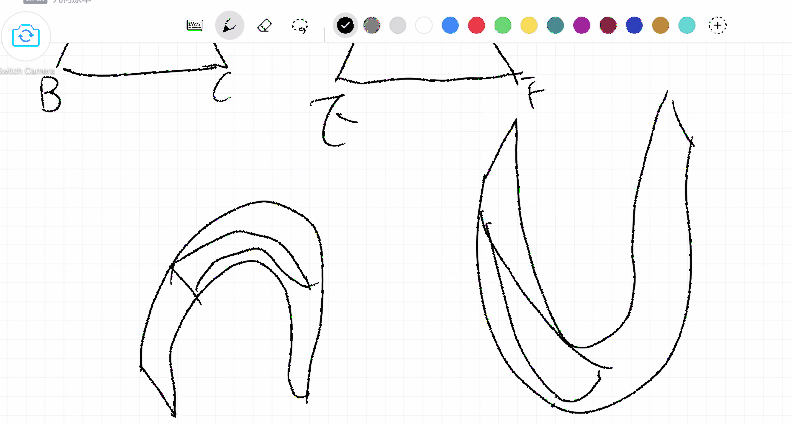

# 第四课（命题四）
**如果两个三角形中两条边互等，并且这些互等的边所夹的角也相等，那么他们的底边也互等，三角形全等，剩余的等边所对的角也互等。**

今天我们一起来看一道非常有争议的命题，命题四。

Alex说这道命题讲的是全等三角形，数学课上已经学了。因此Alex直接口述证明。Alex的证明就是因为两边及夹角相等，所以两个三角形全等。那么我们的问题就来了：有没有想过为什么因为两个边相等夹角相等，所以两个三角形全等？这是全等三角形的一种判定方法没错，但是一开始它是怎么成为一个判定方法呢？我们现在就是探究数学课本为什么这么讲。要知道数学书这么写就是因为欧几里得最开始这么说了，但是欧几里德为什么这么说呢？同样的道理，我们也不能因为它是欧几里德，然后就直接相信他说的话，就直接觉得这是对的。我们也要仔细的看一遍这个证明题。命题四的特殊之处，就在于很多人看完这个全等三角形的证明，认为欧几里得的论证时有问题的。

Alex自己读完证明题，也就问出来了大家都会注意的到的问题，欧几里得为什么可以把一个点放到另一个点上面，又怎么能够保证两点重合又相等。在前面的公理中，欧几里得写了公理4：彼此重合的事物相等。这个公理4不如公设5讲平行的那条出名，然而在我眼中，它的意义却十分重大，因为这个公理是连接现实和几何世界的一座桥梁。重合是一个现实世界中的概念，它是没有在定义中出现的，我们是直接将一个现实中通用的概念，搬运到了几何世界中，然后与相等画了等号。命题四的蹊跷之处，也是源于此，它介于一种不真不假的状态，在现实和几何的交界处被描绘了出来。

Alex说如果可以移动和重合，那也可以旋转，在旋转的情况下，因为始终是同一个三角形，那么旧的和新的就一定全等。是的，也是可以的，那么在这种情况下，前面的公理就是讲重合，就需要描述旋转的性质了。另外Alex也提到了用尺子和量角器的方法，如果说旋转还在那个不真不假的两个世界交界处，那么用到尺子和量角器，就是完全站在现实世界了。这是不一样的。

这个证明题本身的内容，还有另外一个需要注意的地方，就是它本身逻辑的递进关系。证明题本身分成两部分：边角边证全等；全等证余边余角相等。第二部分常常被忽略掉，因为人们下意识的认为，两三角形全等，那么余边余角相等，但其实中间还有夹一步。那就是因为三角形重合，余边余角也重合，所以相等。这个相等不是从三角形的全等直接推出，而是也用了公理四的重合。

另外这道证明题只是关于边角边证全等的，并不涉及其余证全等的方法，比如边边角或者边边边。这一点需要特别注意，其余的方法仍然需要证明才能使用。

讲到这里，也就和Alex一起讨论了为什么数学课和数学书中，教的是定理和性质而不是证明了。其实也不难理解，从古到今，数学家们不停的发展这个学科，写了特别多本书，都是每个人一辈子思考的内容，而发展到今天，我们享受前人努力的成果的同时，也有一个问题，就是我们要在很短的时间内把这些内容都理解和吸收，之后才能继续发展。那这就要求将学习内容精炼和压缩。也就是将被广泛认可的基础证明当做定义告知。然后你就不需要知道他怎么证明，而只需要把它当做定义去使用，因为其他人已经替你证明了他是正确的。而这里的小弊端就是给你造成一种印象：这个东西可以直接用，他就是这个样子的。其实不是的，这些性质和定理在最开始也都是被证明出来的。比如两直线平行，同位角相等，就是命题二十八。所以，我和Alex说，希望他在学习数学的时候也多思考，存有一个怀疑态度，尽管百分之九十九点九九九，课本上的内容尽管不需要证明都是正确的，但是这种怀疑的态度可以保持你思维的敏锐性，多观察，常思考。就比如这个命题四的三角形全等，真的是百分之百正确么？Alex很快就意识到，这其实也不是的，只是因为这里是平面几何，在曲面上就是不同的样子，Alex画出了这样的例子(插图) ，而这种思考其实就是非欧几何的起源。

```{r echo=FALSE, out.width='100%'}

```

另外在这节课的证明论证中，Alex的表达方式也涉及到一个很有意思的问题，也就是数学三种不完整的表达方式：一种是文字描述。第二种是符号和字母。而第三种是图像。我问Alex觉不觉得这件事情非常有意思，就数学到底是什么？好像数学是一种东西，然后它可以用至少三种方式来表达。但是这三种方式表达的数学似乎都是不完整的。我们将这个疑惑留着，慢慢思考。

最后，在这节课上，Alex自己主动思考并且提出了接下来的上课方式。Alex需要课前预习证明题，在每节课开头，我会口述命题内容，Alex自己画图并且论证命题，可以自己想也可以用欧几里得的方法。在课前准备的时候，总要看一下欧几里得的方法，如果和自己的方法不一样，要思考一下哪里不一样，为什么欧几里得用了这种方法。

注：这个证明题用英文读的时候，有几个单词需要学习：enclosed; corresponding.

- enclosed: 围成的，en = in 表状态; closed 封闭的，封闭的状态也就是围起来的
- corresponding：对应的, respond回应；co相互，一起；相互回应也就是一一对应
- 另外还有熟悉let....(已知条件)I say(证明结果)的格式

参考作业：

- 数学是创造的还是发现的，为什么？（不着急回答）
- 找到一个用符号表达的数学方程的例子，用图像/实际产品来描述它，用数字来应用这个原理。你觉得哪种方式更合适？
- 看看你自己的例子，或者拿 "a+b，1+1，一个苹果和一个橙子 "来说，对你来说，哪个更容易接受，为什么？这是否告诉你一些关于数学的来源？

