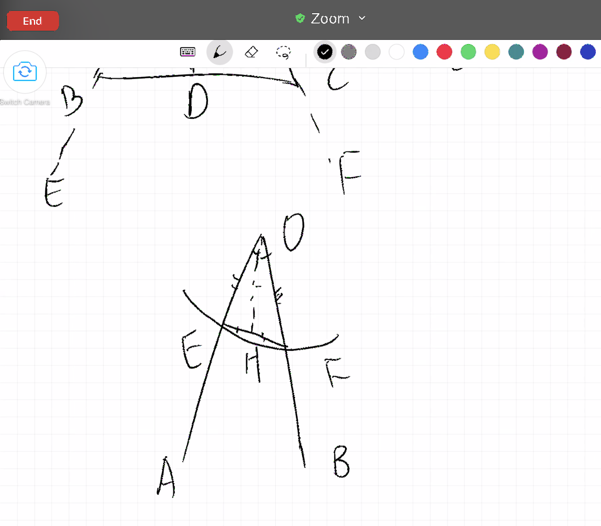

# 第五课（命题五）
**在等腰三角形中，两底角互等，并且如果两腰继续延伸，底边下的两角也互等。**

今天的命题五是关于等腰三角形的，通过命题五的学习，我们将更进一步理解欧几里得证明的严谨性。在反思平常数学的局限的时候，我们寻找避开思维陷阱和突破的方法。

命题五是证明等腰三角形两底角相等，且将两边延长之后，底角的补角也相等。

Alex很是有趣，他说等腰三角形底角相等，直线角180度各自减去相等的两底角肯定也相等呀。所以Alex的尝试一总结为：将命题直接当成性质用，不经证明即声明相等，然后推论补角相等。为什么会发生这样的情况呢？因为Alex记的是等腰三角形两腰相等，两底角相等。这对他来说是类似定义一样的存在，不需要证真，是合理存在的。这也是数学课本中的一个比较普遍的问题，将原本需要证明的命题全都当做了“定义”教授，学生很少去思考为什么和这是怎么证明出来的。

启发学生去反思这个问题，也并不难，只需要提醒一句，在已知的条件中，我们只知道有一个三角形，并且两边相等，其余的一概不知。再问一下他是怎么知道两底角相等的，自然Alex就开始了第二轮探索，尝试自行证明两底角相等。Alex的尝试二可以总结为希望借助等腰三角形三线合一的性质来证小三角形的全等，然后证底角相等。我再次提醒他，三线合一的性质也是需要证明的，我们目前并不知道这一点。于是我们开始分别看三种情况，来推导底角相等。

首先我们一起看了角平分线的可能性。如果能够将角平分，那么等腰三角形被角平分线所切割成的两个小三角形可以通过SAS(边角边)判定全等，那么两个底角作为全等三角形中对应的部分，也自然而然就是相等的了。但是这里有一个问题，我们如何知道所画的直线可以将顶角平分？在Alex的演证过程中，我需要反复问的就是，为什么这条直线将角分成了两半？我同意所画直线将角分成了两部分，但是我怎么知道这两部分是相等的呢？你是不是也需要先证明然后才应用。也就是说，可以用角平分线的方法，但是也要先证明所画的线有将角平分的功能。

我们可以一起来看一下角平分线这个例子 

```{r echo=FALSE, out.width='100%'}

```

所以我们发现如果要用到角平分线，则需要通过SSS(边边边)的方式证三角形全等，而SSS证全等在这一步并不是一个已证明的命题，尽管在命题四的学习中，我们已经对全等三角形有了最初步的认识，但是我们只是知道了两件事情：

1. SAS(边角边)可以证明两三角形全等
2. 全等的三角形三边三角各自相等

从以上两项中是无法直接推导出三边证全等的，也因此Alex不能顺着证明角平分线。

其实无论是第一次对命题的尝试性证明，还是这里的角平分线解法，背后都是同一个问题，那就是学生将学校数学课堂学到的直接运用，而没有去思考背后的逻辑和证明。凡是被老师教授的，在课堂上学到的都是理所当然的。而这一课最重要的学习，也不是欧几里得的证明方法，而是改变之前的反射弧，形成新的习惯，多退回几步问几个为什么。

Alex之后也尝试了画中线还有垂直线的方法。画中线似乎也很简单，在底边上取中点，然后连接顶点即可，但是是不是也需要证明所取的点恰好将底边分成了相等的两部分？而垂直线，我们会发现SSA(边边角)是不能证全等的。和Alex一起看了一组边边角相等但三角形不全等的反例。

只有将种种自己的想法都一一尝试过后，才能更好的理解欧几里得所选用方法的精妙。也因此在学习的过程中，很值得鼓励去自行尝试解题。

除了证明的方法，对这道题的理解，还有一个捷径。也就是用实践的方法来说明等腰三角形底角相等的性质，虽然这不是严谨的证明，但是可以给我们信心，也可以让我坚持对这个性质的探寻。举个例子，最简单的就是说有一个等腰三角形，我们将它对折，然后就发现两部分完全重合，那么底角自然是相等的。Alex也想了一个方法，是有一个直角三角形，然后将它的一个直边固定住，然后旋转180度，原本的三角形和新的三角形组成的大三角形就是等腰三角形，且底角必定也相等。逻辑证明和生活的重合与不同也就这样展现在了我们的面前。数学本身是一种连接，它在成就当下的同时，也为将来的推论做准备，永远都处于一种承前启后的位置上，而生活很多时候不需要解释，不需要逻辑，眼睛看到的，耳朵听到的就是真实。

再一起看完命题五之后，我们一起浏览了一下命题九，因为Alex想知道欧几里得怎么画的角平分线。而我们发现这其中用到了三边相等证全等这一步。这就是命题八的内容，(命题四只证了SAS全等。)而命题八又建立在七上面等等，以此类推，最初的每道证明题都和后面的发展息息相关。忽然在这里，Alex也明白了全等三角形的性质也是需要证明的，并不是理所当然的。

参考作业：

 - 有没有什么常见的说法是别人没有证据就相信的？(不考虑宗教的。)你也相信吗？(看看推理对你的理解有什么影响)
 - 把你上学需要的物品列一个清单。
 - 如果下雨，这有什么不同吗？
 - 如果在早上，你发现自己生病了，这有什么区别吗？
 - 条件是如何影响清单的？(要看到晴天可能是开始时的一个隐藏的、未经证实的假设，它影响了决策过程)
